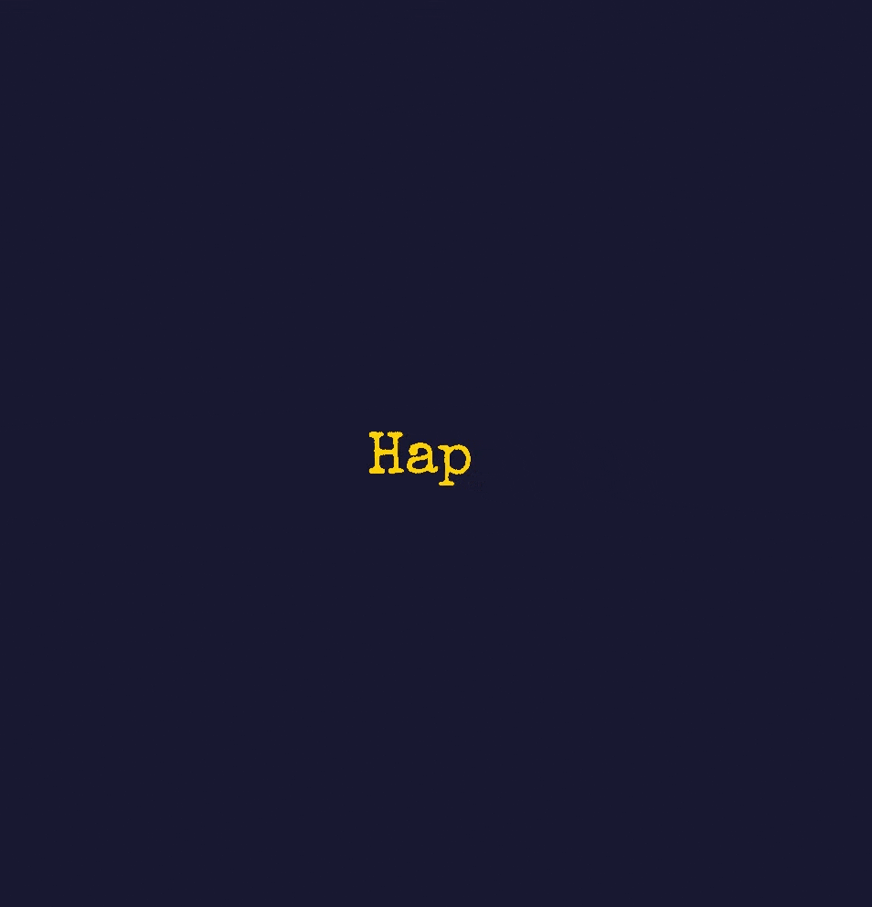

# ⌨️ Typing Animation with Vanilla JS

A simple yet elegant **typewriter-style text animation** built using just **HTML**, **CSS**, and **JavaScript** — no frameworks, no React, no libraries.

Ideal for personal websites, landing pages, or portfolio intros.

---

## 📸 Preview



---

## 📁 Folder Structure

```bash
typewriter-animation/
├── index.html # Main HTML structure
├── style.css # Typewriter styles & animation
└── script.js # Typewriter logic (typing/deleting)
```

---

## 🚀 Getting Started

### 1. Clone the Repo

```bash
git clone https://github.com/kaaviya-n/text-animations.git
cd typewriter-animation
```

### 2. Open in Browser

```bash
open index.html # or just double-click index.html
```
That's it — no build tools, no bundlers.


## 🔑 CSS Concepts Used:

| Concept                      | Description                                 |
| ------------------------     | ------------------------------------------- |
| `@keyframes`                 | Animates the blinking effect                |
| `animation`                  | Applies the `blink` animation to the cursor |
| `white-space: nowrap`        | Prevents text from wrapping                 |
| `overflow: hidden`            | Prevents overflow when deleting text        |
| `font-family: Special Elite` | Gives a typewritter-style look                 |


## 🔑 JavaScript Concepts Used:

| Concept                     | Description                          |
| --------------------------- | ------------------------------------ |
| `document.getElementById()` | Selects HTML element                 |
| `substring(start, end)`     | Slices part of a string              |
| `setTimeout()`              | Delays function calls for animation  |
| `if / else`                 | Conditional branching                |
| `charIndex++` / `--`        | Character typing/deleting logic      |
| `wordIndex++`               | Advances to the next word            |
| `%` Modulo operator         | Used for infinite looping (optional) |


## ✨ Author
Made by **Kaaviya Nakkeeran**